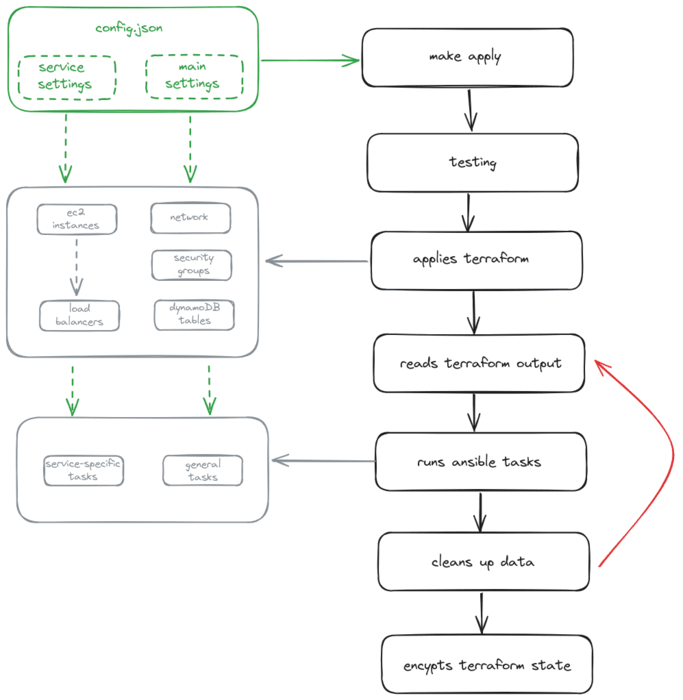

# Work in Progress

## Description

Provisions AWS customizable services infrastructure outside of scaling groups

### What this code does



- runs Terratest (tbc)
- applies Terraform
- feeds required Terraform state data into Ansible
- all EC2 instances are setup and apps provisioned according to individual settings
- starts application(s)
- removes Terraform state data used in Ansible
- encrypts Terraform state

### The Terraform application
- creates VPC with one public subnet and one private subnet per availability zone. The public subnets are connected to an internet gateway
- creates security groups

| Group Name      | Ingress Ports | Egress Ports | IPv6  |
|-----------------|---------------|--------------|-------|
| front-facing*    | 80, 443       | all          | true  |
| ssh             | 22            | set by user  | false |
| custom_ingress  | set by user   | all          | true  |

*_in order to remove http connections on port 80, comment out the relevant block in modules/security_groups/front-facing.tf or replace the CIDR blocks with the loopback addresses provided_

- creates user with full access to DynamoDB
- creates DynamoDB tables
- creates EC2 instances (if a service has more than one instance, it creates a target group attached to a load balancer) 

## Instructions

- Provide the required variables in *config.json*

- _Optional: provide additional settings in *ecosystem.config.json*_

- Run ```make apply```. You will be asked for a password will be used for encrypting the terraform state.

## Setup

The variables required can be set up in the config.json file. 

### Main settings

| Variable              | Type       | Required | Description                                         |
|-----------------------|------------|----------|-----------------------------------------------------|
| key_name              | string     | true     | key name for EC2 access                             |
| ssh_allowed_ips              | string[]     | true     | IP addresses for SSH                             |
| availability_zones    | string[]   | true     | VPC availability zones                              |
| vpc_name              | string     | false    | desired name for the VPC (defaults to "terraform-project") |
| custom_ingress_ports  | string[]   | false    | custom open ports for security groups               |
| dynamodb_user         | string     | false    | name of user with full access to DynamoDB (defaults to "mr_dynamo") |

### Service settings

| Variable          | Type    | Required | Description                                              |
|-------------------|---------|----------|----------------------------------------------------------|
| name              | string  | true     | name of the service                                      |
| git               | string  | true     | url of github repo to be cloned                          |
| security_key_name | string  | false    | name of security key for EC2 access if different than key_name |
| instance_type | string | false | EC2 instance type (defaults to t2.micro) | 
| instance_count    | number  | false    | desired number of initial EC2 instances (defaults to 1)  |

### Example config.json

```json
{
    "key_name": "my-secret-key",
    "availability_zones": ["eu-west-2a", "eu-west-2b", "eu-west-2c"],
    "vpc_name": "my-first-vpc",
    "ssh_allowed_ips": ["8.8.8.8"],
    "custom_ingress_ports": ["3000", "8080"],
    "services": [
        {
            "name": "lighting",
            "git": "github.com/northcoders/ce-project-lights.git",
            "instance_count": 2
        },
        {
            "name": "heating",
            "git": "github.com/northcoders/ce-project-heating.git",
            "security_key_name": "my-second-key",
        }
    ]
}
```

Additional setup for the local pm2 processes is available in *ecosystem.config.json*

## Known bugs
- the load balancers within the EC2 module still need work (viz. they may not target instances with 100% accuracy, an additional, unattached target group is being created, listener ports should be custom, etc)
- service names should not contain hyphens (rather easy to fix... at one point)